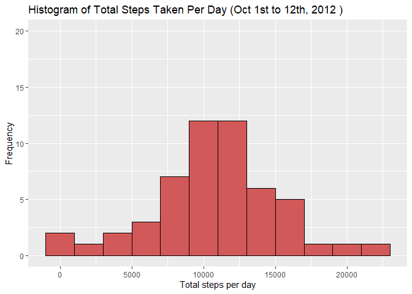
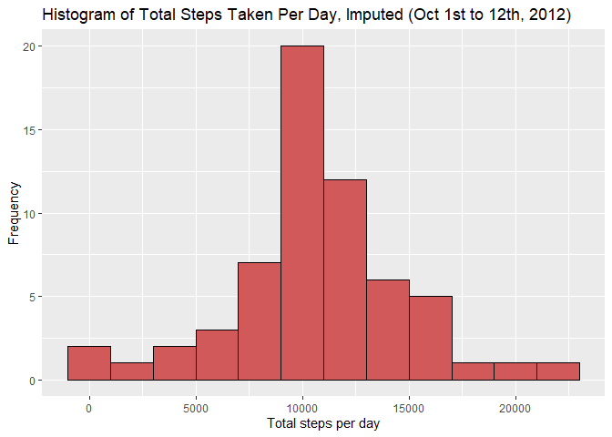

### Loading and processing the data

1.  Load the data

``` r
activity <- read.csv("activity.csv", na.strings = "NA")
```

1.  Transform the date format

``` r
activity$date <- as.Date(activity$date, "%Y-%m-%d")
```

### Histogram of the total number of steps taken each day

1.Calculate the total number of steps

``` r
library(dplyr)
perday <- activity%>%
  group_by(date)%>%
  summarize(sumsteps = sum(steps))
```

2.Make a histogram of the total number of steps taken each day

``` r
library(ggplot2)
ggplot(perday, aes(x = sumsteps)) + 
  geom_histogram(binwidth = 2000, color = "black",fill = "#d25959") +
  ylim(0,20) +
  labs(title = "Histogram of Total Steps Taken Per Day (Oct 1st to 12th, 2012 )") +
  labs(x = "Total steps per day",y = "Frequency")
```



3.Calculate and report the mean and median of the total number of steps
taken per day

``` r
mday <- perday %>%
  summarize(meansteps = mean(sumsteps, na.rm=TRUE), 
            mediansteps = median(sumsteps, na.rm=TRUE))
mean<-as.integer(round(mday[1],digits=0));median<-mday[2]
print(mday)
```

    ## # A tibble: 1 x 2
    ##   meansteps mediansteps
    ##       <dbl>       <int>
    ## 1    10766.       10765

The mean and median of the toal number of steps taken per day are 10766
and 10765, respectively.

### The average daily active pattern

1.  Time series plot of the 5-minute interval and the average number of
    steps taken

``` r
perminute<-activity%>%
  group_by(interval)%>%
  summarize(meansteps=mean(steps, na.rm=TRUE))
ggplot(perminute, aes(x=interval, y=meansteps))+geom_line(color="#d25959",size=0.7)+
  labs(title="Average Activity Pattern Per Day")+labs(x="Time Interval",y="Steps")
```


1.  Find the 5-minute interval that contains the maxium average number
    of steps

``` r
result<-perminute[which.max(perminute$meansteps),]
```

The interval 835 contains the maxium average steps at 206.1698113

### Imputing missing values

1.Calculate and report the total number of missing values in the
dataset.

``` r
totalna<-sum(is.na(activity$steps))
```

There are in total 2304 missing values in the original dataset. 2.Use
the mean for that specific 5-minute interval in place of missing values.

``` r
activity1<-activity
for(i in 1:dim(activity)[1]){
  if(is.na(activity$steps[i])){
    activity1$steps[i]=perminute$meansteps[which(perminute$interval==activity$interval[i])]
  }
}
```

3.Make a histogram of the total number of steps taken each day and
report the mean and median.

``` r
library(dplyr)
perday1<-activity1%>%
  group_by(date)%>%
  summarize(sumsteps=sum(steps))
library(ggplot2)
ggplot(perday1, aes(x=sumsteps)) + geom_histogram(binwidth =2000, color="black",fill="#d25959")+
  labs(title="Histogram of Total Steps Taken Per Day, Imputed (Oct 1st to 12th, 2012)")+
  labs(x="Total steps per day",y="Frequency")
```



``` r
mday1<-perday1%>%
  summarize(meansteps=mean(sumsteps, na.rm=TRUE), mediansteps=median(sumsteps, na.rm=TRUE))
  mean1<-as.integer(round(mday[1]));median1<-as.integer(round(mday[2]))
```

The mean and median total number of steps taken per day after imputation
are 10766 and 10765. They are the same with the previous means and
median acquired before imputation.

Activity patterns between weekdays and weekends
-----------------------------------------------

1.Create a new factor variable in the dataset with two levels –
“weekday” and “weekend”.

``` r
wd<-c()
for(i in 1:dim(activity1)[1]){
  if(as.factor(weekdays(activity1$date[i]))=="Saturday"|as.factor(weekdays(activity1$date[i]))=="Sunday"){
    wd<-c(wd, "weekend")
  }
  else{
    wd<-c(wd, "weekday")
  }
}
activity1<-cbind(activity1, wd)
```

2.Time series plot of the 5-minute interval and the average number of
steps taken, averaged across all weekday days or weekend days.

``` r
perweekday<-activity1%>%
  group_by(wd, interval)%>%
  summarize(meansteps=mean(steps, na.rm=TRUE))
p <- ggplot(perweekday, aes(x=interval, y=meansteps,color=wd)) + geom_line(size=0.7)
p + facet_grid(wd~.,space="free")+theme(legend.title=element_blank(), plot.title=element_text(hjust = 0.5))+ 
  labs(x="Time Interval",y="Number of Steps")+theme(legend.position="none")+
  labs(title="Average Daily Steps by Day Type")
```


